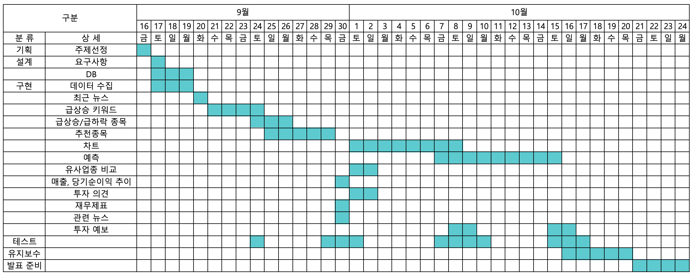

# HINT, 투자 정보 플랫폼

[프로젝트 홈페이지 - https://koposoftware.github.io/finalproject_template/](https://koposoftware.github.io/finalproject_template/)

# 1. 프로젝트 개요

<br>

- 주식 거래 이용자수가 증가하고, 무분별한 투자가 증가함에 따라 부정적인 결과가 나오고 있음
- 투자자들에게 합리적인 투자정보 즉, 힌트를 제공하고자 함

## 1-1 개발환경

```
- Macbook Pro(macOS Monterey) M1 pro chip(10-core cpu) 16GB(RAM) 1TB
- Framework : SpringBoot, React, Flask
- IDE : IntelliJ, DataGrip, Github
- DBMS : Oracle, MySQL
- Cloud : Oracle Cloud(Oracle Linux8(1-core, 1GB(RAM), 50GB) / Ubuntu 21.04(4-core, 24GB(RAM), 100GB))
```

## 1-2 수행기간
<br>

# 2. 프로젝트 구성

## 아키텍쳐


   
## ERD


## 주가 제공 시스템(API Server, Oracle Cloud)


# 3. 기능 설명


# 4. 프로젝트 결과
   
## 발표 ppt 

[발표자료](/발표ppt.pptx)<br>

## 시연 동영상 

  <iframe width="424" height="238" src="https://www.youtube.com/embed/reOGfxYJre0" title="YouTube video player" frameborder="0" allow="accelerometer; autoplay; clipboard-write; encrypted-media; gyroscope; picture-in-picture" allowfullscreen></iframe>

# 5. 본인 소개

|이름 |이정환||
|연락처 | ljhwan8111(@)naver.com|
|skill set| Language - C, JAVA, Python, HTML/CSS/Javascript|
| | Frameword - Spring, Flask, React, JPAOracle, MySQL|
| | Database - Oracle, MySQL|
| | Etc - Oracle Cloud, Git|
|자격증| |
|| |
|수상| |
| | |
|특기사항| |
|| |
|교육| 이노베이션 아카데미(42 Seoul) - C, Linux(2021.11 – 2022.02)|
